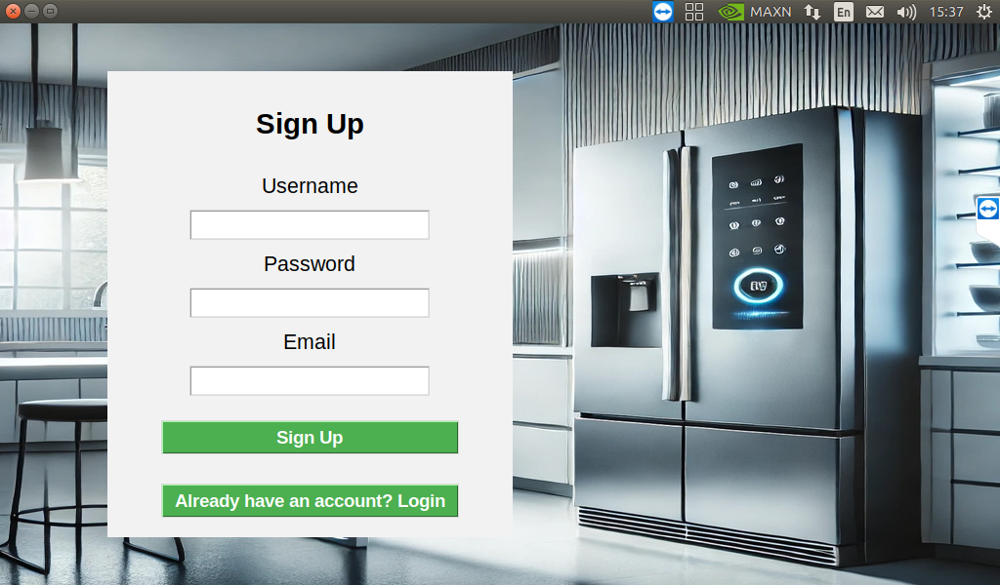

# Cloud-Smart-Refrigerator  
A smart refrigerator system built using Jetson Nano, AWS cloud services, and an Android mobile app.

This project began as a local AI-powered fridge (Part A) and was expanded in Part B into a full cloud-connected ecosystem with secure backend logic and a companion mobile application.

 <!-- Jetson GUI -->
  

    <strong>Refrigerator Sign Up GUI (Jetson Nano)</strong> 
    
  

  
  <!-- Mobile App -->
  

    <strong>Mobile App Login Screen</strong> 
    
  

 

---

##  Overview
The system allows users to:
- Log in securely using AWS Cognito  
- View and manage their shopping list  
- Add or remove items from the fridge  
- Sync data across devices in real time  
- Access their refrigerator remotely through an Android app  

The refrigerator and the mobile app both communicate with AWS Lambda and DynamoDB to keep data consistent and updated.

---

##  Part A — Jetson Nano Local System
The original system (Part A) includes:
- AI-based image classification using **Jetson Inference (GoogLeNet)**
- A touchscreen GUI built in **Python + Tkinter**
- Item detection when placing/removing items from the fridge
- Local shopping list, expired list, and expiring-soon list management

**Key files:**
- `image_classification.py`
- `GUI.py`
- `InitialGUI.py`
- `management.py`
- `item_manager.py`

These scripts handle the local interface, image recognition, user login, and communication between the Jetson Nano and AWS services.

---

##  Part B — Cloud & Mobile App Upgrade
Part B extends the system into the cloud using AWS, enabling remote access and multi-device synchronization.

###  AWS Services
- **AWS Cognito** – Handles user signup/login securely.  
- **AWS Lambda** – Serverless backend logic for item operations.  
- **AWS DynamoDB** – NoSQL database storing all fridge lists.  
- **AWS KMS** – Encrypts sensitive fields such as item amounts.  
- **API Gateway** – Exposes Lambda functions to the Android app.

###  Android App
A lightweight Android application (built with **Java** in Android Studio) enables users to:
- Log in via AWS Cognito  
- View the shopping list in real time  
- Delete items directly from the cloud  
- Refresh the displayed data  
- Enjoy RTL (Right-to-Left) support for Arabic/Hebrew  

All actions taken in the app are immediately reflected in the DynamoDB database and synced across platforms.

---

##  Lambda Functions (Serverless Backend)
The backend includes several AWS Lambda functions that handle all interactions with DynamoDB:

- `Add_Item` – Add an item to a list  
- `Remove_Item` – Remove an item from a list  
- `Update_Item` – Update an item’s properties  
- `Get_Items` – Retrieve a full list  
- `Get_Items_Public` – Retrieve item names for the mobile app  
- `Delete_Item_Public` – Delete an item via the app  
- `Check_Item_Existence` – Avoid duplicates  
- `editUsersData` – Initialize user lists  
- `Get_Default_Items` – Get suggestions for manual entry  

These functions ensure data consistency and secure operations through AWS KMS encryption for sensitive fields.

---

##  System Architecture (Simplified)
Jetson Nano → item_manager.py → AWS Lambda → DynamoDB

Android App → API Gateway → AWS Lambda → DynamoDB

AWS Cognito → Login & authentication
AWS KMS → Encrypts item amounts

The fridge (Jetson Nano) and the Android app act as clients.  
All data is stored and updated exclusively in DynamoDB through Lambda.

---

## Screenshots
The repository includes:
- Jetson Nano login GUI  
- Main fridge interface  
- App login screen  
- App shopping list screen  

These images demonstrate the UI for both the embedded system and the mobile application.

---

## Documentation
Full documentation is available in the `/report/` folder:
- **Final Project Report (PDF)**  
- **Presentation Slides (PPTX)**  

These files explain the design, architecture, cloud flow, security considerations, and testing results.

---

## Summary
This project demonstrates practical experience in:
- Embedded systems (Jetson Nano)
- Cloud architecture using AWS  
- Secure authentication & data encryption  
- Android app development  
- Serverless backend (Lambda)
- Real-time device synchronization  

It represents a complete IoT-style system where hardware, cloud, and mobile platforms work together seamlessly.

---
