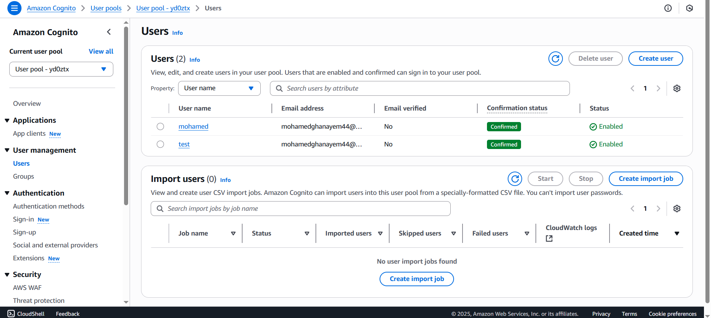
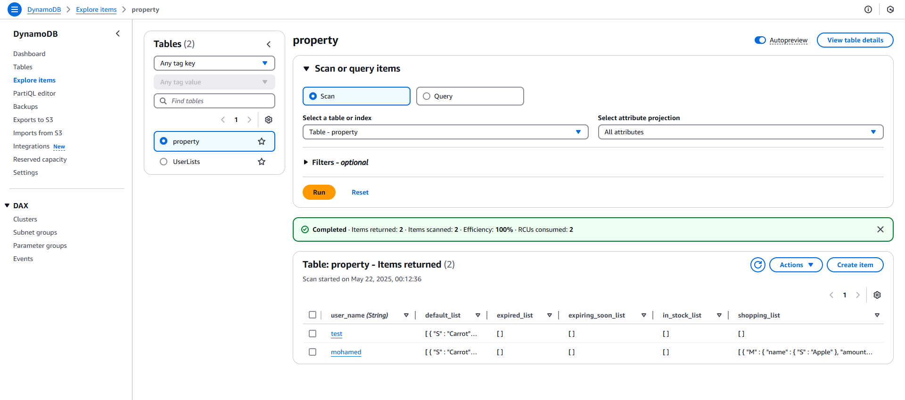
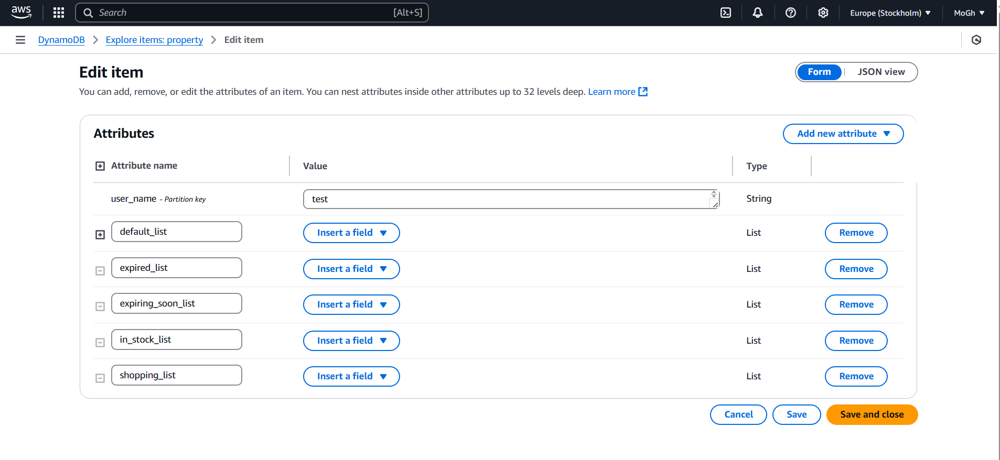
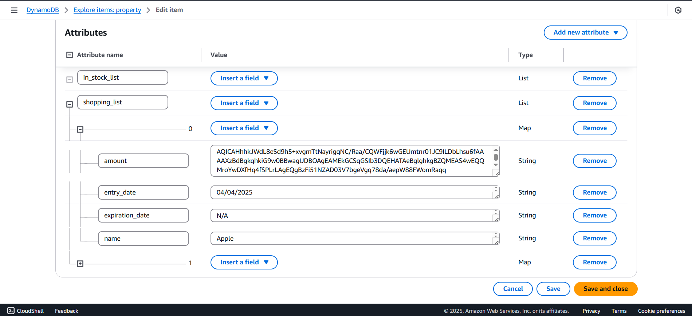

# AWS Lambda Functions

This folder contains all backend Lambda functions used by the **Cloud-Smart-Refrigerator** project.  
These functions form the core serverless backend of the system, handling data storage, user operations, encryption, and communication with the Jetson Nano device and the Android mobile app.

Below is an overview of the AWS components used, along with real screenshots of the environment.

---

##  User Authentication (AWS Cognito)

All users authenticate using **AWS Cognito User Pools**.  
Each user is stored securely with verification and activation statuses.

  

---

## Serverless Backend (AWS Lambda)

The project contains multiple Lambda functions (Python 3.9), including:

- `Add_Item`
- `Remove_Item`
- `Update_Item`
- `Get_Items`
- `Get_Items_Public`
- `Delete_Item_Public`
- `Check_Item_Existence`
- `Get_Default_Items`
- `editUsersData`
- `CreateUserListsLambda`

These functions handle all communication between the Jetson Nano, the Android app, and DynamoDB.

  

---

## Database (AWS DynamoDB)

All refrigerator data is stored in a **NoSQL DynamoDB table** named `property`.  
Each user has their own entry containing:

- `in_stock_list`
- `shopping_list`
- `expired_list`
- `expiring_soon_list`
- `default_list`
- encrypted `amount` values (using KMS)

### DynamoDB Tables

  

###  User Data Records

  

### Nested Item Structure (with Encryption)

  

---

## Summary

This Lambda backend enables:

- Secure user authentication  
- Fully cloud-based refrigerator state  
- Real-time synchronization between Jetson Nano & Android app  
- Encrypted item quantities (AWS KMS)  
- Serverless scalability with AWS Lambda  

The functions in this folder implement all business logic for the Cloud-Smart-Refrigerator system.

---
